# Banking Management System (Java JSP + Servlets + JDBC + MySQL)

## Overview

A full-stack Banking Management System developed using Java, JSP, Servlets and MySQL following MVC layered architecture.

The application supports secure user authentication, account creation, beneficiary management, fund transfer, passbook tracking and admin-level account approval workflows.

This project demonstrates backend architecture design using Servlets, DAO pattern and JDBC-based persistence with MySQL along with Bootstrap-based responsive UI.

---

## Tech Stack

Java (Core Java)

JSP

Servlets

JDBC

MySQL

Bootstrap

Apache Tomcat v9

MVC Architecture

DAO Design Pattern

---

## Features

User Registration and Login

Create Bank Account

Add Beneficiary

Transfer Money

View Transaction History

Passbook View

Customer Profile Management

Admin Dashboard

Approve Accounts

Manage Users

Admin Transaction Monitoring

Session Handling and Authentication

Exception Handling

Layered Architecture Implementation

---

## Architecture

The project follows MVC layered architecture:

Controller Layer → Servlets

Service Layer → Business Logic

DAO Layer → Database Operations

Model Layer → Entity Classes

View Layer → JSP Pages

---

## Database

Database Name:

bankingdb

Tables Used:

users  
accounts  
transactions  
beneficiaries  

Update database credentials inside:

src/main/java/com/aurionpro/util/DBUtil.java

before running the project.

---

## How to Run the Project

Clone the repository:

git clone https://github.com/Samruddhi2003github/banking-system-java-jsp-servlet-jdbc

Import project into Eclipse / Spring Tool Suite (STS)

Start MySQL server

Ensure database exists:

bankingdb

Update DB credentials inside:

DBUtil.java

Start Apache Tomcat v9 server

Open browser:

http://localhost:8081/Banking_app/login.jsp

---

## Screenshots

### Login Page

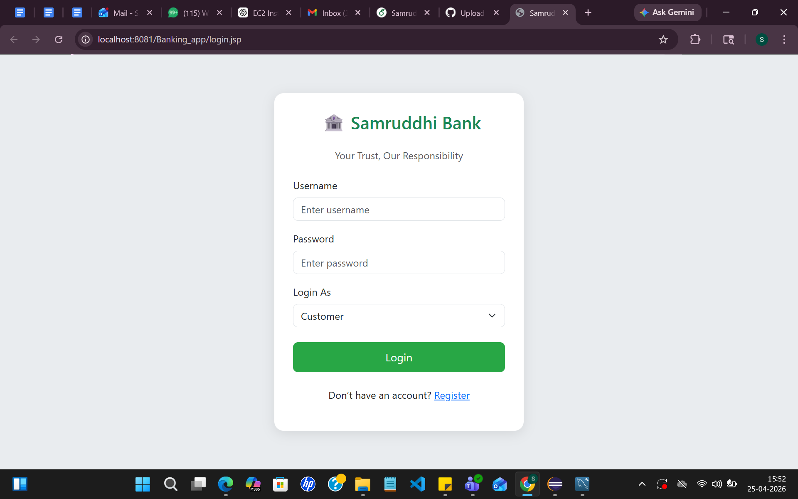

---

### Registration Page

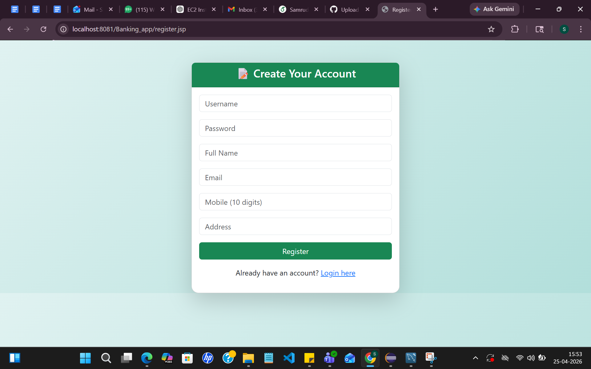

---

### Create Account Page

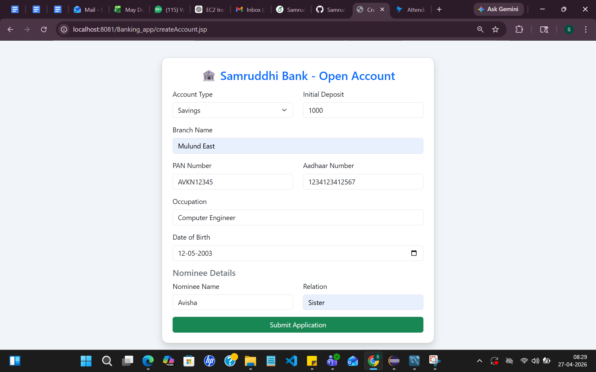

---

### Add Beneficiary Page

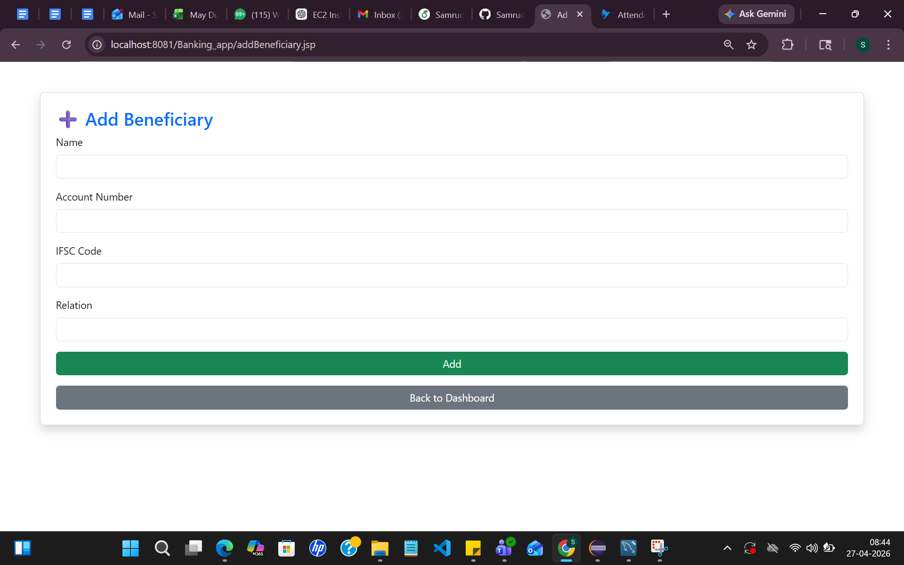

---

### Customer Dashboard

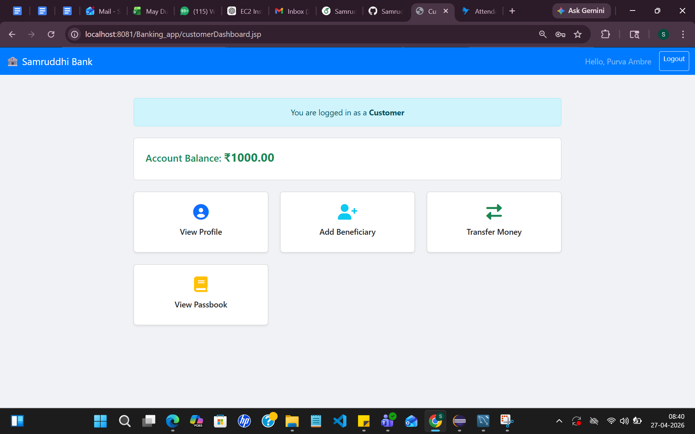

---

### Customer Profile

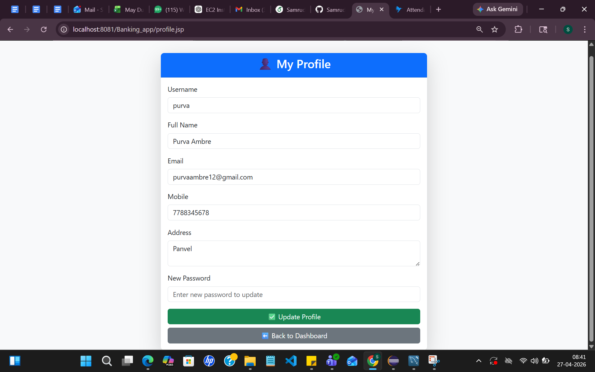

---

### Transaction History

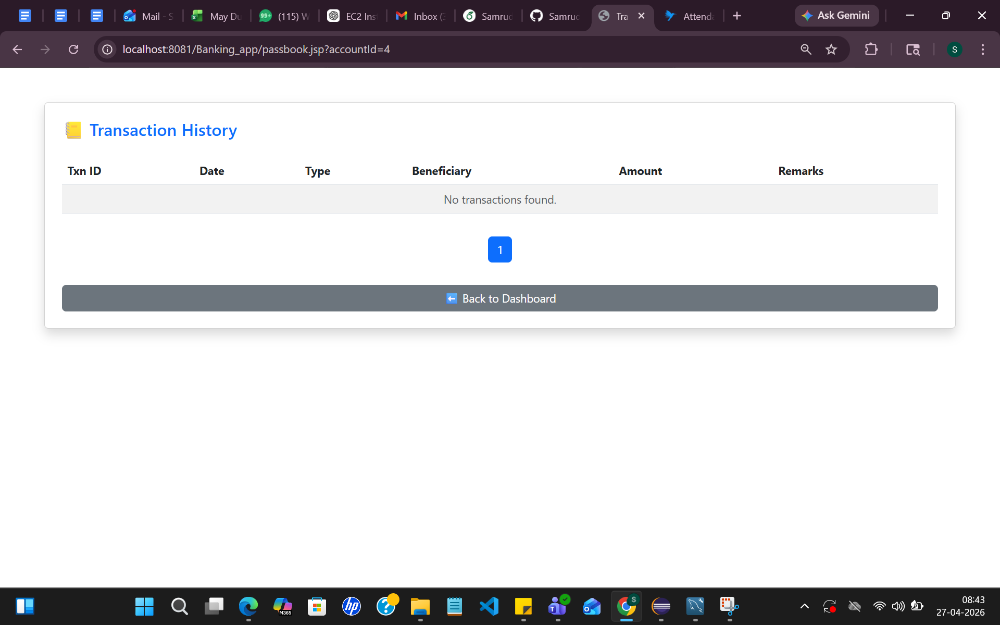

---

### Admin Dashboard

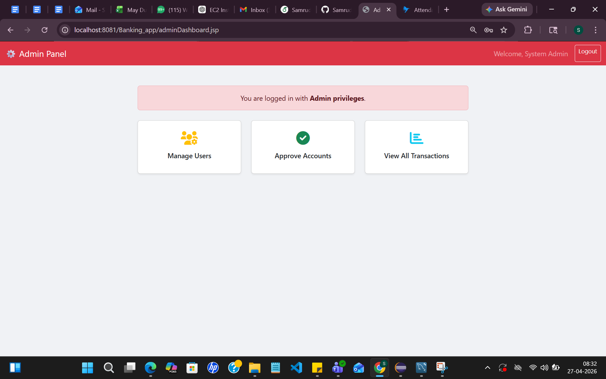

---

### Approve Accounts

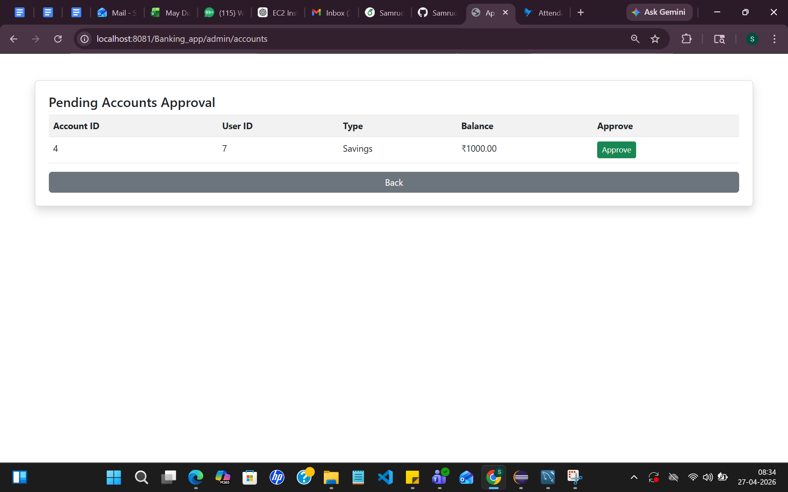

---

### Manage Users

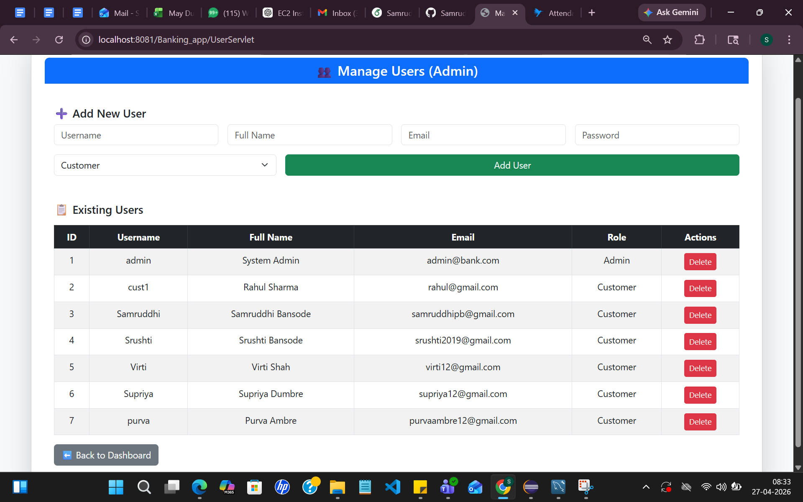

---

### Admin Transaction Monitoring

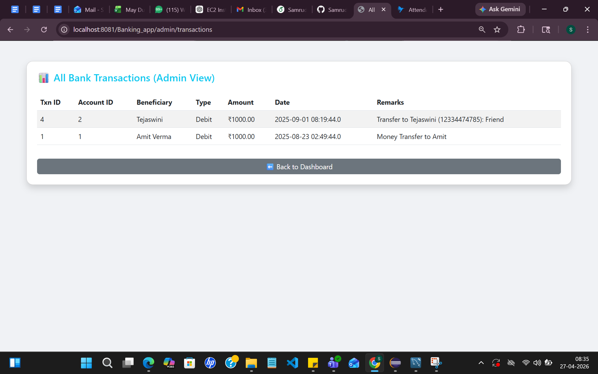

---

### Database Schema

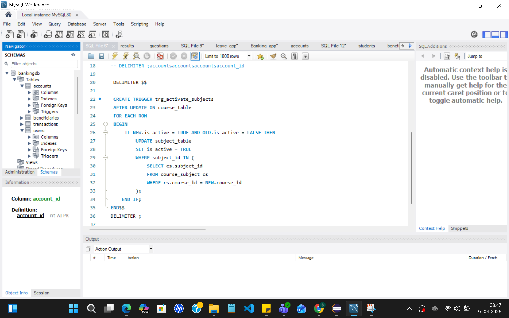

---

## Key Learning Outcomes

Implemented MVC architecture using Servlets and JSP

Designed layered backend architecture (Controller → Service → DAO → Model)

Integrated MySQL database using JDBC

Implemented authentication and session management

Developed admin approval workflows

Designed transaction and beneficiary management modules

Applied exception handling for robust backend operations

Built Bootstrap-based responsive UI

---

## Author

Samruddhi Bansode

AI & Data Science Engineer  
Java Backend Developer  
Machine Learning Enthusiast
